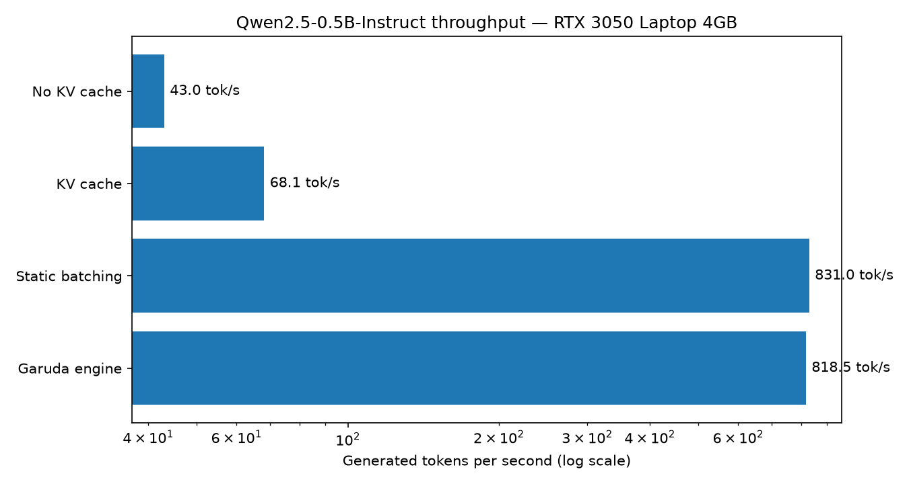
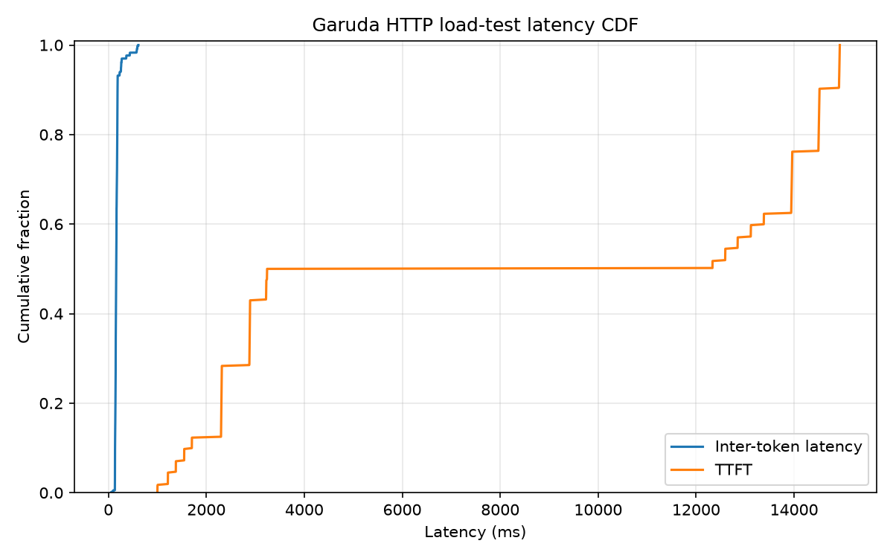

# shrike

[](https://github.com/Azimml/shrike/actions/workflows/ci.yml)
[](LICENSE)
[](pyproject.toml)

An LLM inference engine built from scratch in pure PyTorch — no vLLM, no
flash-attn, no custom CUDA. Loads Qwen2.5 safetensors directly and serves them
over an OpenAI-compatible async HTTP API with the same core machinery as
production engines:

- **KV cache** — the textbook decode optimization
- **Paged KV cache** — block-table memory management (PagedAttention, [vLLM, SOSP '23](https://arxiv.org/abs/2309.06180))
- **Continuous batching** — iteration-level scheduling ([Orca, OSDI '22](https://www.usenix.org/conference/osdi22/presentation/yu))
- **Chunked prefill** — token-budget steps so long prompts can't stall decodes ([Sarathi-Serve, OSDI '24](https://arxiv.org/abs/2403.02310))
- **Prefix caching** — hash-chained block reuse across requests (vLLM v1 APC / [RadixAttention](https://arxiv.org/abs/2312.07104))
- **N-gram speculative decoding** — draft-model-free prompt-lookup speculation, verified in one batched forward
- **Triton paged-attention decode kernel** — the fused alternative to the pure-PyTorch gather path
- **Async serving layer** — FastAPI + asyncio, SSE token streaming, OpenAI-compatible `/v1/chat/completions`, hundreds of concurrent requests multiplexed onto one GPU decode loop

Everything measured on a **4GB RTX 3050 Laptop GPU** — memory pressure is the
point: paging matters most when VRAM is scarce.

## Results

All rungs run the same seeded variable-length workload (32–256 output tokens
per request, greedy, HF transformers bf16 as the baseline implementation):

| Rung | Configuration | tok/s | vs rung 1 |
|---|---|---|---|
| 1 | HF, no KV cache, batch=1 (full-prefix recompute) | 43.0 | 1× |
| 2 | HF, KV cache, batch=1 | 68.1 | 1.6× |
| 3 | HF, static batching (64 reqs, padded to longest) | 831.0 useful (1477 raw) | 19.3× |
| 4 | **shrike** (paged KV + continuous batching + chunked prefill) | **818.5** | **19.0×** |

Two honest observations, because benchmarks that only flatter are worthless:

- **Static batching ties the engine (±1.5%) on this workload** — all 64
  requests fit in one batch, which is static batching's best case. Its raw
  throughput (1477 tok/s) is 44% padding waste decoding rows that already
  hit their target length; continuous batching backfills that waste, which
  is why the *useful* numbers converge. The engine's win is everything
  static batching cannot do at all: requests arriving over time, streaming,
  per-request lengths, admission control.
- **The ~19× is against a recompute-everything baseline** on short-ish
  generations; it grows with sequence length (the recompute cost is
  quadratic). The vLLM-comparable number is rung 4 vs rung 2: **~12×**.

**Load test** — 512 concurrent streaming HTTP clients, single burst, 64
tokens each, `max_running=256`:

| metric | value |
|---|---|
| success | 512/512, 0 failures, 0 preemptions |
| aggregate throughput | **1302 tok/s** (25.2s wall) |
| TTFT | p50 7.8s · p99 15.0s (burst queueing behind admission control) |
| inter-token latency | p50 162ms · p99 613ms |
| prefix cache hit rate | 95.5% (shared chat-template preamble) |

**Speculative decoding** (`spec_ngram=2`): on repetition-friendly output
(echo/summarize/extract), 26 → 140 tok/s single-stream (**5.4×**) with 100%
draft acceptance and provably identical outputs; on non-repetitive text it
degrades gracefully toward baseline.

### Feature ablation (with vs without each technology)

Offline toggles (`python -m bench.ablation`, same 64-prompt workload) and
serving A/Bs (`bench.load_gen --long-every 8 --stagger-s 8`, 128 concurrent,
every 8th request a ~1,600-token prompt):

| Technology | Without | With | Verdict |
|---|---|---|---|
| KV cache (bs=1) | 43.0 tok/s | 68.1 tok/s | 1.6× (grows with length) |
| Continuous batching | 68.1 tok/s | 818 tok/s | **12×** |
| Prefix caching, short prompts | 842 tok/s | 807 tok/s | ~4% hashing overhead |
| Prefix caching, shared long prefixes | — | 97% block reuse | TTFT 853ms → 96ms (CLI multi-turn) |
| Chunked prefill (staggered long prompts) | TTFT p99 1370ms · ITL p99 99.5ms | TTFT p99 952ms · ITL p99 68.6ms | **−31% tail latency**, equal throughput |
| N-gram speculation, general chat | 807 tok/s | 584 tok/s (27% acceptance) | −28%: drafts mostly rejected |
| N-gram speculation, repetitive output | 26 tok/s | 140 tok/s (≥92% acceptance) | **5.4×** |

The two-sided rows are the point: prefix caching costs a little on cache-cold
short prompts and pays hugely on shared prefixes; speculation is a bet on
output repetitiveness that loses on general chat — which is exactly why
production engines make both toggleable per deployment.




## Architecture

```
HTTP (FastAPI, SSE)  ──►  AsyncEngine (asyncio bridge, per-request queues)
  /v1/chat/completions           │ background task
  /v1/completions                ▼
                          LLMEngine.step()
                 schedule ─► forward ─► sample ─► stream
                    │            │
             Scheduler       ModelRunner
      (continuous batching,  (flat token batch, paged
   chunked prefill budget,    attention: scatter K/V to
   preemption, FCFS admit)    block pool + gather/SDPA
                    │          — or Triton decode kernel)
              BlockManager   PagedKVBackend
       (free list, refcounts,  [L, 2, slots, H_kv, D]
        prefix-cache hashes)      bf16 KV pool
```

- One `step()` = one flat `[N_tokens]` forward mixing decodes (1 token/seq)
  and prefill chunks, capped by a token budget (Sarathi). Dense layers don't
  care about sequence boundaries; only attention reads the batch metadata.
- Block size 16; blocks are ref-counted and content-hashed
  (`h_i = hash(h_{i-1}, tokens_i)`), so shared prompt prefixes are served
  from cache with zero recompute.
- Preemption = discard-and-recompute (free victim's blocks, requeue).
- The Qwen2 transformer takes an **injectable attention backend**, so the same
  model code serves the HF-parity test (naive contiguous cache), the offline
  baselines, and the paged batched engine (einsum or Triton decode).

### Deep dive: the paged KV cache

The KV pool is one fixed tensor `[num_layers, 2, num_slots, num_kv_heads,
head_dim]`, carved into `block_size`-token blocks (16 by default). A sequence
never owns a contiguous slice of it — instead it holds a **block table**, a
list of block ids. New tokens are written into whichever free blocks the
allocator hands out, and attention reads context back through the block table.
That indirection is what eliminates fragmentation: any free block fits any
sequence, so the pool packs to near-100% utilization instead of wasting the
gap between a sequence's length and its next power-of-two reservation.

Allocation is a plain free list (`collections.deque`), popped from the left so
eviction is LRU. `blocks_needed()` computes the *delta* — `ceil(total /
block_size) - len(block_table)` — so a decode step that stays inside the
current final block allocates nothing, which is the common case.

**Automatic prefix caching** rides on top. Every *full* block is content-keyed
by a chain hash `h_i = hash(h_{i-1}, tokens_i)`, so two requests that share a
prompt prefix compute identical hashes for the shared blocks. Freed blocks
keep their hash and stay on the free list; a later request that matches the
hash *revives* the block (ref count 0 → 1) instead of recomputing its KV.
Blocks are ref-counted, so a shared prefix is safely read by many sequences at
once and only truly freed when the last owner releases it. The match
deliberately stops one token short of the whole prompt — the forward pass
still needs at least one uncached token to produce logits to sample from.

### OpenAI-compatible serving

The server speaks the OpenAI wire format, so any OpenAI client library points
at it unchanged:

```python
from openai import OpenAI

client = OpenAI(base_url="http://localhost:8000/v1", api_key="not-needed")
stream = client.chat.completions.create(
    model="shrike",
    messages=[{"role": "user", "content": "Explain paged attention briefly."}],
    stream=True,
)
for chunk in stream:
    print(chunk.choices[0].delta.content or "", end="", flush=True)
```

Endpoints: `POST /v1/chat/completions` (streaming SSE `chat.completion.chunk`
frames and non-streaming JSON with a `usage` block), `POST /v1/completions`
(legacy text completion), `GET /v1/models`, `GET /health`, `GET /metrics`.
The chat endpoint renders messages through the model's own chat template and
maps shrike's internal finish reasons (`stop`/`length`) onto the OpenAI
vocabulary. Its request/response schema and SSE framing are unit-tested
against a mocked engine, so they run in CI with no GPU or model download
(`tests/test_openai_api.py`).

### Model registry

`shrike/config.py` holds a small registry of the Qwen2.5 sizes the engine has
been run against (0.5B / 1.5B / 3B) and the single source of truth for the
model path (`DEFAULT_MODEL_DIR`, overridable via the `SHRIKE_MODEL_DIR`
environment variable). The loader is architecture- rather than size-specific —
every dimension is read from `config.json` — so pointing `scripts/download_model.py`
and the CLI/server `--model` flag at a larger snapshot just works, VRAM
permitting.

### Profiling (py-spy flame graphs)

`bench/results/flame_offline.svg` (engine hot path, 3× offline workload) and
`bench/results/flame_serving.svg` (server during four consecutive
256-concurrent load runs — warm engine sustains ~1,700 tok/s). The measured
Python-side costs, as fractions of total samples:

| Hot path | ~% | What a production engine does instead |
|---|---|---|
| eager RoPE math (fp32 outer/cat/cos/sin per step) | 9% | fused into the attention kernel |
| paged block gather + grouped-einsum decode attention | 10% | fused paged-attention CUDA kernel reads block tables in-kernel |
| K/V scatter into the block pool (`index_copy_`) | 5% | fused into the same kernel |
| per-layer Python op dispatch (24 layers × ~12 ops × every step) | large | CUDA graphs replay the whole decode step as one launch |

This is the quantified answer to "why is vLLM faster than a pure-PyTorch
engine": not the scheduling design (same algorithms), but kernel fusion and
launch elimination.

### Head-to-head vs vLLM (same GPU, same harness, same workload)

vLLM **0.10.2** serving the identical Qwen2.5-0.5B bf16 snapshot on the same
RTX 3050 4GB (`--enforce-eager`, protocol in `bench/compare_vllm.md`), driven
by the identical load generator: 256 streaming requests × 64 forced tokens,
burst-open. Zero failures on all three servers. **Measured July 2026** — vLLM
moves fast, so this compares against that specific release on that specific
hardware.

| | aggregate tok/s | TTFT p99 | inter-token p99 |
|---|---|---|---|
| vLLM 0.10.2 | **3,445** | **893ms** | **94ms** |
| shrike (Triton decode kernel) | 1,739 | 5,057ms | 778ms |
| shrike (einsum decode) | 1,524 | 3,819ms | 780ms |

**The gap is 2.0× — and the flame graphs above account for it.** vLLM fuses
RoPE/RMSNorm/attention into CUDA kernels, runs its scheduler in optimized
code, and batches sampling natively; shrike pays Python dispatch on all of
it. Writing the Triton paged-attention decode kernel closed part of the
distance (+14% here, +27% offline) and demonstrates the path: each remaining
Python hot spot is a fusion candidate. Losing to a large production engine by
2× with ~1,900 lines of readable Python (the engine package) is the trade this
project chose on purpose — the scheduling algorithms are the same; the kernels
are the moat.

## Limitations (honest)

- The einsum backend gathers each sequence's KV blocks into a contiguous
  tensor before `scaled_dot_product_attention` — a production engine reads the
  block table inside a fused paged-attention kernel. The Triton decode kernel
  does exactly that for the decode step; prefill still uses sliced SDPA.
- No tensor/pipeline parallelism, no quantization, no LoRA — single GPU,
  single model, bf16.
- Sampling supports greedy / temperature / top-p; no top-k, beam search, or
  logit bias.
- Benchmarked on one 4GB laptop GPU. The scheduling and memory-management
  design is hardware-independent, but the absolute numbers are not.

**Future work:** CUDA graphs for the decode step (the largest remaining Python
cost), draft-model speculative decoding, a fused Triton prefill kernel.

## Run it

Requires Python ≥ 3.11. The default attention path is pure einsum and needs no
Triton; Triton (the fused decode kernel) is an optional Linux/CUDA extra.

```bash
python -m venv .venv && source .venv/bin/activate
pip install -r requirements.lock.txt   # exact, reproducible pins
pip install -e .                        # install shrike + console scripts

python scripts/download_model.py        # Qwen2.5-0.5B-Instruct into models_cache/
pytest -m "not integration"             # fast unit tests: no model, no GPU
pytest -m integration                   # HF parity + paging correctness (needs model + GPU)

shrike-serve --model models_cache/qwen2.5-0.5b-instruct   # serve on :8000
curl -N localhost:8000/v1/chat/completions -H 'content-type: application/json' \
  -d '{"model":"shrike","stream":true,"messages":[{"role":"user","content":"Explain paged attention briefly."}]}'
```

For a CUDA build of PyTorch, install torch from the matching index first (see
`requirements.lock.txt`), then `pip install -e .`. The Triton decode kernel is
enabled with `shrike-serve --attention-backend triton`.

Benchmarks: `python -m bench.baselines --rung 1|2|3`, `python -m bench.bench_engine`,
`python -m bench.load_gen --concurrency 512`, `python -m bench.ablation`,
`python -m bench.plots`.

## Interactive CLI

Run `shrike --model models_cache/qwen2.5-0.5b-instruct` (or
`python -m shrike.cli`). Type `/help` in the REPL to see the available
commands. It streams multi-turn chat with sampling controls, live metrics,
prefix-caching and speculation toggles, and a `/bench` command to watch
continuous batching scale.

## Tests & CI

The suite splits into two tiers, so the fast tier runs anywhere:

- **Unit** (default, `pytest -m "not integration"`): block allocator + prefix
  cache, scheduler chunked-prefill/preemption logic, n-gram drafting, the
  batched sampler on synthetic logits, the Triton kernel numerics
  (auto-skipped without CUDA), and the OpenAI endpoint schema against a mocked
  engine. **No model download, no GPU.**
- **Integration** (`@pytest.mark.integration`): HF-transformers parity and
  paged/continuous-batching correctness. Needs the model weights on disk (and
  in practice a CUDA device); auto-skipped when the snapshot is absent.

CI (GitHub Actions, Python 3.11 and 3.12) installs CPU-only PyTorch, checks
`ruff format` + `ruff check` (must pass), runs `mypy` (advisory, currently
clean), and executes the unit tier. It never touches a GPU or downloads a
model.

## Development

```bash
pip install -e ".[dev]"   # ruff, pytest, mypy
make check                # the pre-push gate: ruff format --check, ruff check, unit tests
```

`make` wraps the common tasks (`make help` lists them): `fmt`, `lint`,
`typecheck`, `test`, `test-all`. They mirror CI, so a green `make check` is a
green pull request. See [CONTRIBUTING.md](CONTRIBUTING.md) for the full
workflow and test-tier conventions, and [examples/](examples/) for a runnable
client against the OpenAI-compatible server.

## Troubleshooting

- **`request needs up to N KV blocks but the pool has only M`** — the prompt
  plus `max_new_tokens` can't fit in the KV pool even empty. Shorten the
  prompt, lower `max_tokens`, or give the pool more room with a higher
  `gpu_mem_util` (or a smaller model). The pool is sized once at startup from
  free VRAM × `gpu_mem_util`.
- **`model snapshot not found`** (tests) or a tokenizer load error (serving) —
  run `python scripts/download_model.py`, or point `SHRIKE_MODEL_DIR` at an
  existing snapshot. Integration tests skip automatically when no snapshot is
  present; they do not fail.
- **CUDA out of memory at startup** — lower `--max-running`, lower
  `gpu_mem_util`, or use a smaller model. On a 4GB card the 0.5B model is the
  comfortable default.
- **`No module named 'triton'` / Triton import errors** — Triton is a
  Linux/CUDA-only optional extra. The default `--attention-backend einsum`
  needs no Triton and runs on CPU; only pass `--attention-backend triton` when
  the `.[triton]` extra is installed on a CUDA host.
- **Garbled or `�` characters mid-stream** — expected transiently: multi-byte
  glyphs span several BPE tokens, so the incremental decoder buffers until the
  bytes complete. If they persist to the end of a response, that is a real bug
  — please file it.
- **Server returns 422 on a chat request** — the payload failed validation
  (empty `messages`, an unknown `role`, `top_p` outside `(0, 1]`, or a request
  too large for the KV pool). The error body's `message` says which.

## What I learned / design decisions

- **The scheduler is the interesting part; the kernels are the moat.** shrike
  implements the same iteration-level scheduling, paging, and prefix-caching
  algorithms as vLLM and lands within 2× on identical hardware. The remaining
  gap is entirely kernel fusion and launch elimination — which the flame
  graphs quantify hot spot by hot spot. Building the engine first and
  profiling it made "why is production inference fast" a measured answer
  rather than a slogan.
- **An injectable attention backend paid for itself repeatedly.** The same
  transformer code drives HF parity, the naive baseline, the paged engine, and
  the Triton kernel — the correctness tests and the benchmark rungs are the
  *same model* with different backends, which is what makes the comparisons
  trustworthy.
- **Every feature is a tradeoff, so every feature is a toggle.** Prefix caching
  costs hashing on cache-cold prompts; speculation loses on non-repetitive
  output; chunked prefill trades a little throughput for a lot of tail
  latency. The ablation table reports the losses as loudly as the wins,
  because that is the actual reason production engines make these knobs
  per-deployment.
- **Correctness is defined against a reference, not against a vibe.** Paged,
  batched, chunk-prefilled generation is verified token-for-token against a
  naive single-sequence cache and against HF transformers, with an explicit,
  documented tolerance for bf16 near-ties rather than a flaky exact-match
  assertion.
